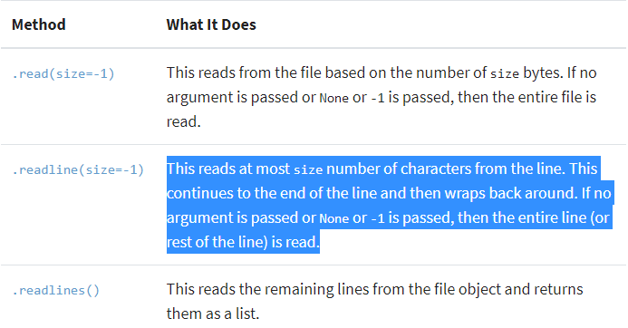
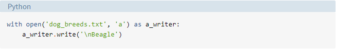

## Files:
#### -Header: metadata about the contents of the file (file name, size, type, and so on)
#### -Data: contents of the file as written by the creator or editor
#### -End of file (EOF): special character that indicates the end of the file

#### If you would access that without using the full path You can use the special characters double-dot (..) to move one directory up.
### Opening and Closing a File in Python:
#### When you want to work with a file, the first thing to do is to open it. This is done by invoking the open() built-in function. open() has a single required argument that is the path to the file. open() has a single return.

#### Reading and Writing Opened Files:
## Reading Methods:

### Appending to a File
#### Sometimes, you may want to append to a file or start writing at the end of an already populated file. This is easily done by using the 'a' character for the mode argumen

#### Some helpful libraries:
#### -wave: read and write WAV files (audio)
#### -aifc: read and write AIFF and AIFC files (audio)
#### -sunau: read and write Sun AU files
#### -tarfile: read and write tar archive files
#### -zipfile: work with ZIP archives
#### -configparser: easily create and parse configuration files
#### -xml.etree.ElementTree: create or read XML based files
#### -msilib: read and write Microsoft Installer files
#### -plistlib: generate and parse Mac OS X .plist files
#### -PyPDF2: PDF toolkit
#### -xlwings: read and write Excel files
#### -Pillow: image reading and manipulation

## The Assertion Error Exception
#### Instead of waiting for a program to crash midway, you can also start by making an assertion in Python. We assert that a certain condition is met. If this condition turns out to be True, then that is excellent! The program can continue. If the condition turns out to be False, you can have the program throw an AssertionError exception.

## The `try` and `except` Block: 
#### The `try` and `except` block in Python is used to catch and handle exceptions. Python executes code following the try statement as a “normal” part of the program. The code that follows the except statement is the program’s response to any exceptions in the preceding try clause.
!()[https://files.realpython.com/media/try_except_else_finally.a7fac6c36c55.png]
## `else`:
#### You can instruct a program to execute a certain block of code only in the absence of exceptions.
## `finally`: 
#### Allow you to implement some sort of action to clean up after executing your code.

##### Resources:
- [Files](https://realpython.com/read-write-files-python/)
- [Error Exception](https://realpython.com/python-exceptions/)

***Done by Omar-zoubi***
- [GitHub Link](https://github.com/Omar-zoubi)
- [Linkedin Link](https://www.linkedin.com/in/omar-alzoubi-54034bb4/)
