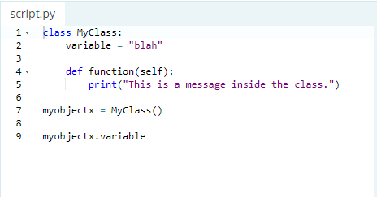
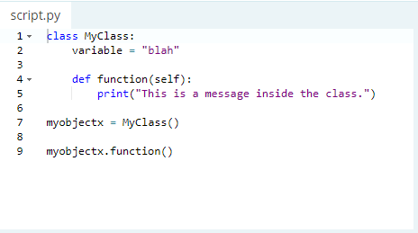

## Object:
#### Is an encapsulation of variables and functions into a single entity. Objects get their variables and functions from classes. Classes are essentially a template to create your objects. 
### Accessing Object Variables:

### Now we have a copy of `MyClass()` called `myobjectx`.
#### Accessing Object Functions:

#### Now I have an access to all the class including its functions.

##### Resources:

- [Error Exception](https://www.learnpython.org/en/Classes_and_Objects)

***Done by Omar-zoubi***
- [GitHub Link](https://github.com/Omar-zoubi)
- [Linkedin Link](https://www.linkedin.com/in/omar-alzoubi-54034bb4/)
