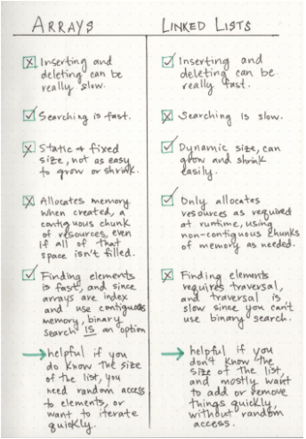

## Linked Lists:
#### A Linked List is a sequence of Nodes that are connected/linked to each other. The most defining feature of a Linked List is that each Node references the next Node in the link.
### Some details about Linked list:
#### -Singly: linked list means that there is only one reference.
#### - Doubly: linked list means that there is a reference to both the Next and Previous node.
#### -Nodes: individual items/links that live in a linked list. Each node contains the data for each link.
#### -Next: This property contains the reference to the next node.
#### -Head: reference of type Node to the first node in a linked list.
#### -Current: is a reference of type Node to the node that is currently being looked at. 

#### *We use `while` to move to next node and we can use `next!=null` as a condition.

## Memory management:
#### The biggest differentiator between arrays and linked lists is the way that they use memory in our machines. Those of us who work with dynamically typed languages like Ruby, JavaScript, or Python don’t have to think about how much memory an array uses when we write our code on a day to day basis because there are several layers of abstraction that end up with us not having to worry about memory allocation at all.
#### When an array is created, it needs a certain amount of memory. If we had 7 letters that we needed to store in an array, we would need 7 bytes of memory to represent that array. But, we’d need all of that memory in one contiguous block. That is to say, our computer would need to locate 7 bytes of memory that was free, one byte next to the another, all together, in one place.
#### On the other hand, when a linked list is born, it doesn’t need 7 bytes of memory all in one place. One byte could live somewhere, while the next byte could be stored in another place in memory altogether! Linked lists don’t need to take up a single block of memory; instead, the memory that they use can be scattered throughout.

### Lists for all shapes and sizes:
#### The way that we structure our linked lists can be quite different.  Singly linked lists are the simplest type of linked list, based solely on the fact that they only go in one direction. There is a single track that we can traverse the list in; we start at the head node, and traverse from the root until the last node, which will end at an empty null value.
#### But just as a node can reference its subsequent neighbor node, it can also have a reference pointer to its preceding node, too! This is what we call a doubly linked list, because there are two references contained within each node: a reference to the next node, as well as the previous node. This can be helpful if we wanted to be able to traverse our data structure not just in a single track or direction, but also backwards, too.

### Circular linked list:

#### It has a node that acts as the tail of the list (rather than the conventional head node), and the node after the tail node is the beginning of the list. This organization structure makes it really easy to add something to the end of the list, because you can begin traversing it at the tail node, as the first element and last element point to one another.

### Big O Notation:
#### is a way of evaluating the performance of an algorithm.
***the speed and efficiency with which something functions when its input grows to be any (crazy big!) size.***
### Growing a linked list
#### All we really need to do is rearrange our pointers. We know that a linked list is made up a single node, and a node always contains some data and, most importantly, a pointer to the next node or null.
#### Some thing you have to take in your consideration:
***a linked list is usually efficient when it comes to adding and removing most elements, but can be very slow to search and find a single element.***

### situations to choose between linked list and array:

##### Resources:

- [Linked list](https://medium.com/basecs/whats-a-linked-list-anyway-part-2-131d96f71996)

***Done by Omar-zoubi***
- [GitHub Link](https://github.com/Omar-zoubi)
- [Linkedin Link](https://www.linkedin.com/in/omar-alzoubi-54034bb4/)
