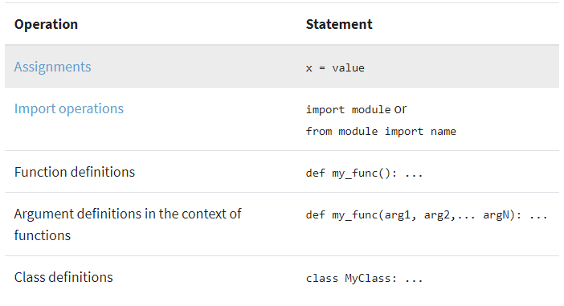
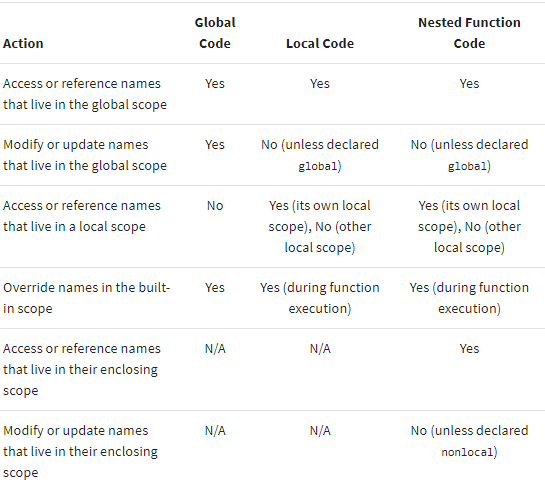
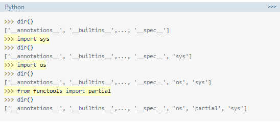

## Scope :
#### The concept of scope rules how variables and names are looked up in your code. It determines the visibility of a variable within the code. The scope of a name or variable depends on the place in your code where you create that variable. The Python scope concept is generally presented using a rule known as the LEGB rule.

## How to create Python names?

### Python Scope vs Namespace
#### In Python, the concept of scope is closely related to the concept of the namespace. As you’ve learned so far, a Python scope determines where in your program a name is visible. Python scopes are implemented as dictionaries that map names to objects. These dictionaries are commonly called namespaces. These are the concrete mechanisms that Python uses to store names. They’re stored in a special attribute called .__dict__.

#### Names at the top level of a module are stored in the module’s namespace. In other words, they’re stored in the module’s .__dict__ attribute. 

## LEGB Rule for Python Scope(Local, Enclosing, Global, and Built-in):
### -Local (or function): 
#### scope is the code block or body of any Python function or lambda expression. This Python scope contains the names that you define inside the function. These names will only be visible from the code of the function. It’s created at function call, not at function definition, so you’ll have as many different local scopes as function calls. This is true even if you call the same function multiple times, or recursively. Each call will result in a new local scope being created.

### -Enclosing (or nonlocal):
#### scope is a special scope that only exists for nested functions. If the local scope is an inner or nested function, then the enclosing scope is the scope of the outer or enclosing function. This scope contains the names that you define in the enclosing function. The names in the enclosing scope are visible from the code of the inner and enclosing functions.

### -Global (or module):
#### scope is the top-most scope in a Python program, script, or module. This Python scope contains all of the names that you define at the top level of a program or a module. Names in this Python scope are visible from everywhere in your code.
### -Built-in scope:
#### is a special Python scope that’s created or loaded whenever you run a script or open an interactive session. This scope contains names such as keywords, functions, exceptions, and other attributes that are built into Python. Names in this Python scope are also available from everywhere in your code. It’s automatically loaded by Python when you run a program or script.

#### At any given time during execution, you’ll have at most four active Python scopes—local, enclosing, global, and built-in—depending on where you are in the code. On the other hand, you’ll always have at least two active scopes, which are the global and built-in scopes. These two scopes will always be available for you.
### -Functions: The Local Scope:
#### The local scope or function scope is a Python scope created at function calls. Every time you call a function, you’re also creating a new local scope. On the other hand, you can think of each def statement and lambda expression as a blueprint for new local scopes. These local scopes will come into existence whenever you call the function at hand.

### -Modules: The Global Scope
#### From the moment you start a Python program, you’re in the global Python scope. Internally, Python turns your program’s main script into a module called __main__ to hold the main program’s execution. The namespace of this module is the main global scope of your program.

### -Implications of Python scope:

#### Modifying the Behavior of a Python Scope:
#### -global :you can define a list of names that are going to be treated as global names.
#### -nonlocal :you can define a list of names that are going to be treated as nonlocal by following the keyword by one or more names separated by commas.

### Bringing Names to Scope With import
#### You need to import the modules or the names explicitly:

## Using Scope Related Built-In Functions:
### -globals()
#### In Python, globals() is a built-in function that returns a reference to the current global scope or namespace dictionary. This dictionary always stores the names of the current module. This means that if you call globals() in a given module, then you’ll get a dictionary containing all the names that you’ve defined in that module, right before the call to globals(). 
### -locals()
#### Another function related to Python scope and namespaces is locals(). This function updates and returns a dictionary that holds a copy of the current state of the local Python scope or namespace. When you call locals() in a function block, you get all the names assigned in the local or function scope up to the point where you call locals().
### -vars()
#### vars() is a Python built-in function that returns the .__dict__ attribute of a module, class, instance, or any other object which has a dictionary attribute. Remember that .__dict__ is a special dictionary that Python uses to implement namespaces
### -dir()
#### You can use dir() without arguments to get the list of names in the current Python scope. If you call dir() with an argument, then the function attempts to return a list of valid attributes for that object.

##### Resources:

- [Scoup](https://realpython.com/python-scope-legb-rule/)

***Done by Omar-zoubi***
- [GitHub Link](https://github.com/Omar-zoubi)
- [Linkedin Link](https://www.linkedin.com/in/omar-alzoubi-54034bb4/)