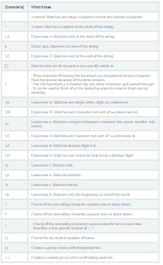

## Python Regular Expression Tutorial:
#### Regular Expressions, often shortened as regex, are a sequence of characters used to check whether a pattern exists in a given text (string) or not. If you've ever used search engines, search and replace tools of word processors and text editors - you've already seen regular expressions in use. They are used at the server side to validate the format of email addresses or passwords during registration, used for parsing text data files to find, replace, or delete certain string, etc. They help in manipulating textual data, which is often a prerequisite for data science projects involving text mining.
### Basic Patterns: Ordinary Characters:
- match() function returns a match object if the text matches the pattern.
- search() you scan through the given string/sequence, looking for the first location where the regular expression produces a match.
- group() returns the string matched by the re. You will see both these functions in more detail later.
- [abc] - Matches a or b or c.
- [a-zA-Z0-9] - Matches any letter from (a to z) or (A to Z) or (0 to 9).
- `\` Backslash.
    - If the character following the backslash is a recognized escape character, then the special meaning of the term is taken 
    - if the character following the \ is not a recognized escape character, then the \ is treated like any other character and passed through.
    - `\` can be used in front of all the metacharacters to remove their special meaning.

- \t - Lowercase t. Matches tab.
- \n - Lowercase n. Matches newline.
- \r - Lowercase r. Matches return.
- \A - Uppercase a. Matches only at the start of the string. Works across multiple lines as well.
- \Z - Uppercase z. Matches only at the end of the string.
- {x} - Repeat exactly x number of times.
- {x,} - Repeat at least x times or more.
- {x, y} - Repeat at least x times but no more than y times.

### Summery :

### High-level File Operations:
#### Copying Files:
- copyfile() copies the contents of the source to the destination and raises IOError if it does not have permission to write to the destination file.
#### Copying File Metadata
- To copy the permissions from one file to another, use copymode().
#### Working With Directory Trees: 
- To copy a directory from one place to another, use copytree().
- copytree() accepts two callable arguments to control its behavior.
- ignore_patterns() is used to create an ignore function to skip copying Python source files.

#### Search:
- The which() function scans a search path looking for a named file.
#### System Space:
- disk_usage() returns a tuple with the total space, the amount currently being used, and the amount remaining free.

##### Resources:

- [Python RegEx](https://www.datacamp.com/community/tutorials/python-regular-expression-tutorial)

To download [Click Here](https://drive.google.com/uc?export=download&id=12VzQURwwUjwJRB2e7Y1kk6_9jK2O9nk9)

***Done by Omar-zoubi***
- [GitHub Link](https://github.com/Omar-zoubi)
- [Linkedin Link](https://www.linkedin.com/in/omar-alzoubi-54034bb4/)