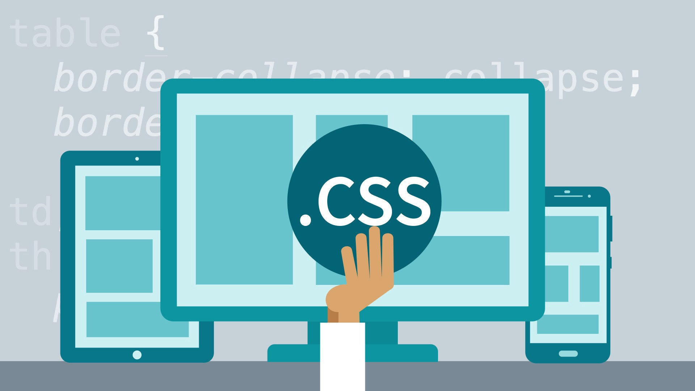

# Cascading Style Sheets

## What is Cascading Style Sheets?

### CSS is a styling way that used to creat and style the web pages , It makes styling an easy prosses 
### CSS can control the layout a page by elements which play an important part in creating layouts.

