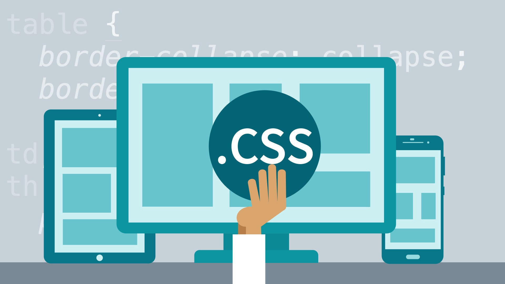

# Cascading Style Sheets

## What is Cascading Style Sheets?

### Cascading Style Sheets for Abbreviation: CSS; It is a formatting language for web pages concerned with the shape and design of websites, specially designed to isolate formatting from the content of the written document and this applies to colors, fonts, images and backgrounds that are used on pages, with complete flexibility and ease. This technology deals with the overall appearance of web pages, including colors, images, and more. 
### CSS describes how HTML elements are to be displayed on screen, paper, or in other media
## CSS saves a lot of work. It can control the layout of multiple web pages all at once
## External stylesheets are stored in CSS files
### It's realy great how it can group the styling features in one file or single comand line 

This webpage by Omar-Zoubi 
[GitHub Link](https://github.com/Omar-zoubi)