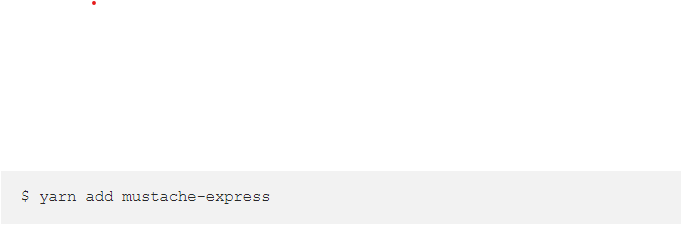
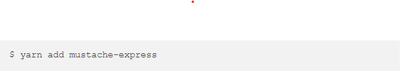

## Javascript Templating:
#### Javascript templating is a fast and efficient technique to render client-side view templates with Javascript by using a JSON data source. The template is HTML markup, with added templating tags that will either insert variables or run programming logic.
## Mustache:
#### Mustache is a logic-less template syntax. It can be used for HTML, config files, source code — anything. It works by expanding tags in a template using values provided in a hash or object.

### Mustache-Express:
#### If you intend you use mustache with Node and Express, you can use mustache-express. Mustache Express lets you use Mustache and Express together easily.

Or :

## FLEXBOX:
#### The Flexible Box Module, usually referred to as flexbox, was designed as a one-dimensional layout model, and as a method that could offer space distribution between items in an interface and powerful alignment capabilities. This article gives an outline of the main features of flexbox, which we will be exploring in more detail in the rest of these guides.

### FlexBox terminology:
#### Since flexbox is a whole module and not a single property, it involves a lot of things including its whole set of properties. Some of them are meant to be set on the container (parent element, known as “flex container”) whereas the others are meant to be set on the children (said “flex items”).

#### main axis – The main axis of a flex container is the primary axis along which flex items are laid out. Beware, it is not necessarily horizontal; it depends on the flex-direction property (see below).
#### -main-start | main-end – The flex items are placed within the container starting from main-start and going to main-end.
#### -main size – A flex item’s width or height, whichever is in the main dimension, is the item’s main size. The flex item’s main size property is either the ‘width’ or ‘height’ property, whichever is in the main dimension.
#### -cross axis – The axis perpendicular to the main axis is called the cross axis. Its direction depends on the main axis direction.
#### -cross-start | cross-end – Flex lines are filled with items and placed into the container starting on the cross-start side of the flex container and going toward the cross-end side.
#### -cross size – The width or height of a flex item, whichever is in the cross dimension, is the item’s cross size. The cross size property is whichever of ‘width’ or ‘height’ that is in the cross dimension.

### Flexbox properties:

***Done by Omar-zoubi***
- [GitHub Link](https://github.com/Omar-zoubi)
- [Linkedin Link](https://www.linkedin.com/in/omar-alzoubi-54034bb4/)